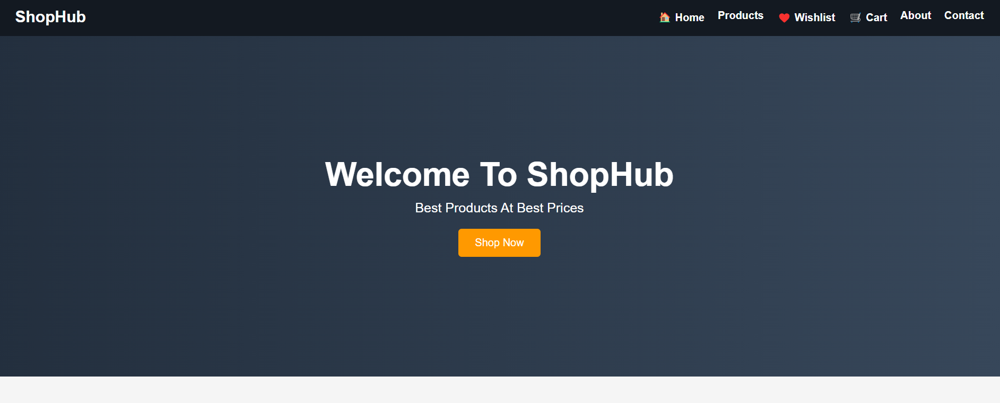
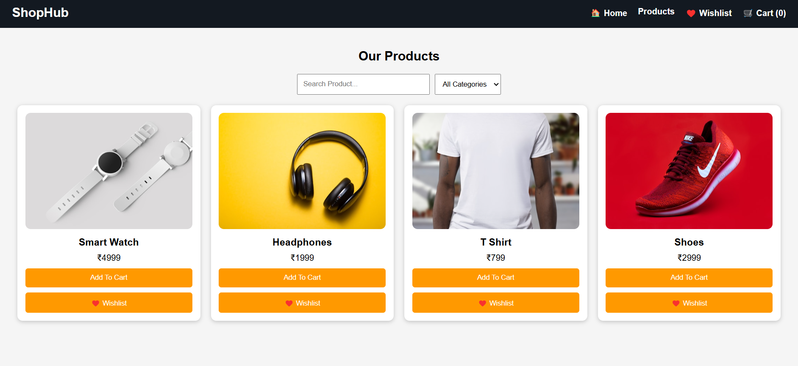
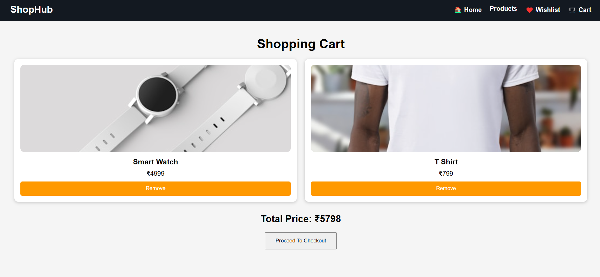
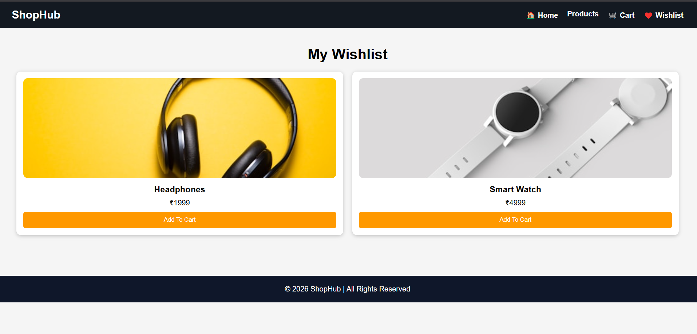
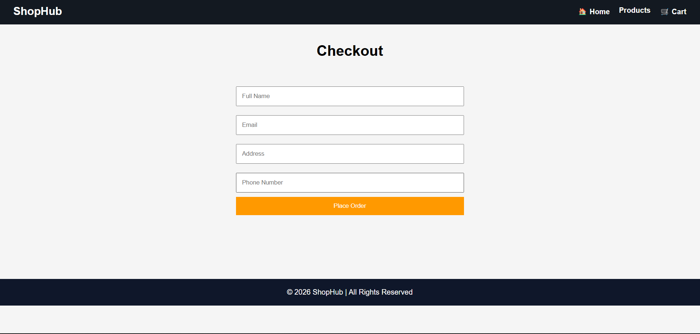
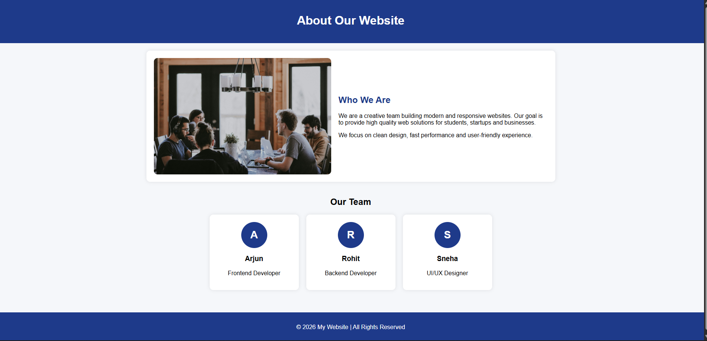

# 🛒 ShopHub - E-Commerce Website

ShopHub is a modern frontend e-commerce website built using **HTML, CSS, and JavaScript**.  
It includes product listing, cart system, wishlist feature, and checkout functionality using localStorage.
---

##  Live Demo
https://sanjeev-kumar80.github.io/shophub-ecommerce/

---

---

## 📸 Project Screenshots

### 🏠 Home Page


### 🛍️ Products Page


### 🛒 Cart Page


### ❤️ Wishlist Page


### 💳 Checkout Page


### ℹ️ About Page


### 📞 Contact Page


---

# 🧑‍💻 Tech Stack

- HTML5  
- CSS3  
- JavaScript (Vanilla JS)  
- LocalStorage (for cart & wishlist)

---


## ✨ Features

### 🏠 Home Page
- Hero section
- Featured products
- Navigation bar

### 🛍️ Products Page
- Product grid layout
- Search functionality
- Add to Cart & Wishlist

### 🛒 Cart System
- Add/remove items
- Total price calculation
- Stored in localStorage

### ❤️ Wishlist
- Save favorite products
- Move items to cart

### 💳 Checkout Page
- Simple form (name, email, address, phone)
- Order confirmation alert
- Cart reset after order

---


##  Project Structure


Project/
│
├── index.html
├── products.html
├── cart.html
├── wishlist.html
├── checkout.html
├── about.html
├── contact.html
│
├── css/
│   └── style.css
│
└── js/
    ├── products.js
    ├── cart.js
    └── wishlist.js


---

## ⚙️ How It Works

- Products are stored in JavaScript arrays
- Cart & Wishlist use `localStorage`
- DOM manipulation handles UI updates
- No backend required (fully frontend project)

---

## 🧪 How to Run Project

1. Clone repository
```bash
  git clone https://github.com/sanjeev-kumar80/shophub-ecommerce.git

2. Open project folder
3. Open index.html in browser


📈 Future Improvements
Add backend (Node.js / Firebase)
User login system
Payment gateway integration
Product detail page
Database integration


👨‍🎓 Project Purpose

This project is created for:

College submission
Frontend development practice
JavaScript DOM understanding
E-commerce logic learning


---

📞 Contact
Email: sanjeev20565@gmail.com
GitHub: https://github.com/sanjeev-kumar80/


---

## ⭐ Support

If you found this project helpful or interesting, please consider giving a ⭐ to the repository.  
It helps me stay motivated and improve future projects.